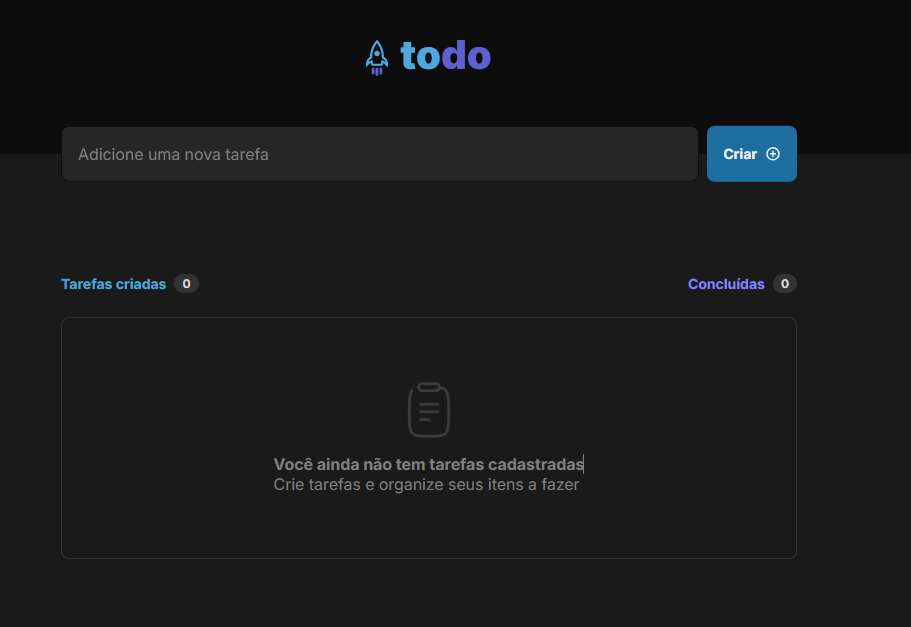
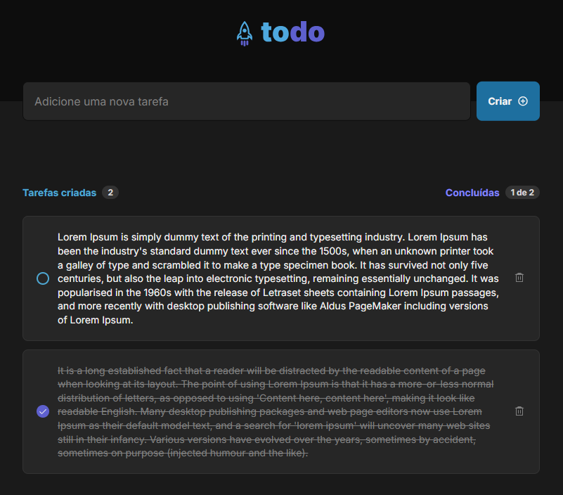

# 📋 To-Do List 🚀

**Uma aplicação simples, funcional e elegante para organizar suas tarefas do dia a dia.**

Este projeto foi desenvolvido como parte de um desafio do curso de React.js da [Rocketseat](https://rocketseat.com.br/). A aplicação aproveita o poder do **React.js** e a velocidade do **Vite** para criar uma experiência de usuário ágil e moderna.

---

## ✨ Funcionalidades

- 📌 **Adicionar tarefas**: Insira suas tarefas com apenas um clique.
- ✅ **Marcar como concluída**: Organize sua lista e visualize suas conquistas.
- 🗑️ **Excluir tarefas**: Limpe a lista removendo o que não é mais necessário.
- 📊 **Contador de tarefas**: Visualize rapidamente quantas tarefas você tem pendentes ou já concluiu.

---

## 🔧 Tecnologias

O projeto foi desenvolvido utilizando as seguintes tecnologias:

- **React.js**: Biblioteca JavaScript para construção de interfaces de usuário.
- **Vite**: Build tool extremamente rápido e moderno para desenvolvimento com React.
- **CSS Modules**: Estilização encapsulada para componentes React.
- **ESLint**: Garantir qualidade e consistência no código.
- **JavaScript (ES6+)**: Padrões modernos de JavaScript.

---

## 🚀 Como rodar o projeto

Siga os passos abaixo para rodar o projeto localmente:

1. Clone este repositório:

   ```bash
   git clone https://github.com/gafredo/todo-list.git
   cd todo-list
   ```

2. Instale as dependências:

   ```bash
   npm run dev
   ```

3. Inicie o servidor de desenvolvimento:

   ```bash
   npm run dev
   ```

4. Acesse no navegador:
   http://localhost:5173

---

## 🌟 Demonstração




---

## 📜 Licença

Este projeto está sob a licença MIT.

---

## 🙌 Agradecimentos

Este projeto foi desenvolvido como parte de um desafio da Rocketseat. Um grande agradecimento à comunidade pela inspiração e suporte. 🚀

---

## 🌐 Conecte-se

📧 Email: gafredo@gamil.com
💼 LinkedIn: [Acesse](https://www.linkedin.com/in/gabriel-fredo-38211650/)
